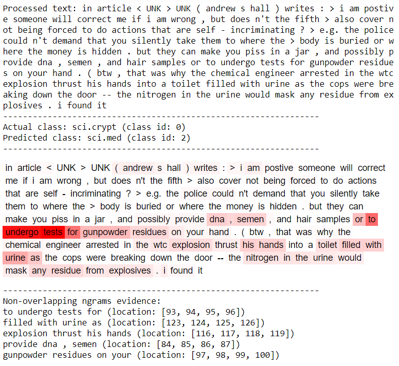

# Human-grounded Evaluations of Explanation Methods for Text Classification. EMNLP-IJCNLP 2019
**Authors**: [Piyawat Lertvittayakumjorn](https://www.doc.ic.ac.uk/~pl1515/) and [Francesca Toni](https://www.doc.ic.ac.uk/~ft/) (Department of Computing, Imperial College London)

**Paper link**: [https://arxiv.org/abs/1908.11355](https://arxiv.org/abs/1908.11355)

**Contact**: Piyawat Lertvittayakumjorn (pl1515 [at] imperial [dot] ac [dot] uk)

## Description
This repository contains codes used for training 1D convolutional neural networks for text classification and explaining the predictions (by highlighting evidence and counter-evidence texts in the input). Our code supports many local explanation methods such as [LIME](https://github.com/marcotcr/lime), [LRP, and DeepLIFT](https://github.com/albermax/innvestigate) as well as two new model-specific methods proposed in our paper -- Grad-CAM-Text and Decision Tree Extraction. For an example, please see `examples/4Newsgroup.ipynb`.   

## How to use this repository
### Requirements
- [Python 3.6](https://www.python.org/downloads/release/python-360/)
- [Virtual environments](https://virtualenv.pypa.io/en/stable/installation/)
- [Bash shell](https://www.gnu.org/software/bash/) (or [Git bash](https://git-scm.com/downloads) for Windows users)

### Installation
1. Clone this project
	
	    git clone https://github.com/plkumjorn/CNNAnalysis.git

2. Inside the project folder, run the setup shell script

		bash setup.sh

3. Install [Graphviz](https://www.graphviz.org/download/) engine. For Windows users, you may need to indicate the path to Graphviz bin in `analysis/settings.py` after installation. For example,

		GRAPHVIZ_PATH = 'C:\\Program Files (x86)\\Graphviz2.38\\bin'

4. (Optional) If you want to rerun our EMNLP experiments, you need to run another setup script to download the preprocessed data.

		bash emnlp_experiments/setup.sh

5. (Optional) To run a jupyter notebook if you need,

		python -m ipykernel install --user --name=venv
		jupyter nbextension enable --py widgetsnbextension --sys-prefix
		jupyter notebook

### Usage
- Ensure that the virtual environment is activated. To activate, 
	- For MacOS, Linux (bash)

			source venv/bin/activate
	- For Windows,

			source venv/Scripts/activate
- If you want to create your own 1D CNN model and run explanation methods, please see a notebook `examples/4Newsgroup.ipynb` as an example.<br/>


- If you want to rerun the experiments in our paper, generating explanation results for two datasets (Amazon and ArXiv), please see the two scripts in the `emnlp_experiments` folder. To download the data, follow step 5 above.
- Do not forget to deactivate the virtual environment after use.

		deactivate

### Datasets
In the paper, we use two English textual datasets.

- [**Amazon** review polarity](http://goo.gl/JyCnZq) by [Zhang et al, 2015](https://papers.nips.cc/paper/5782-character-level-convolutional-networks-for-text-classification.pdf).
- **ArXiv** abstracts which we collected and created by ourselves using [ArXiv API](https://arxiv.org/help/api). It consists of three main categories: Computer Science (CS), Mathematics (MA), and Physics (PH). Due to the structure of classes, this dataset can be used in many classification settings, e.g., multi-class, multi-label, fine-grained, and coarse-grained classification. In the paper, we use this dataset for single-label coarse-grained (3-way) classification. 
	- [arxiv-clean-formatted-1375204.pickle](https://imperialcollegelondon.box.com/s/meeo6wpa0vz0c8vlhkfe8jxd0bjog6jh) stores a list of 1,375,204 ArXiv items each of which has the following format. During preprocessing, we removed all citation commands `\cite{}` and replaced all math equations in titles and abstracts by `<MATH>`.

		```
		{'oai_identifier': 'oai:arXiv.org:0704.0068', 
		'id': '0704.0068', 
		'title': 'A Note About the {Ki(z)} Functions', 
		'abstract': "In the article [Petojevic 2006], A. Petojevi\\' c verified useful ... ", 
		'categories': ['math.NT', 'math.CV']}
		```

	- [classLabels.csv](https://imperialcollegelondon.box.com/s/mb1qc22j059l0h5iszxgpcose7ivd6mn) stores the list of 153 ArXiv categories (codes, labels, and descriptions); however, the descriptions of some categories are missing.

		```
		ClassCode,ClassLabel,ClassDescription
		astro-ph,Astrophysics,
		astro-ph.CO,Cosmology and Nongalactic Astrophysics,"Phenomenology of early universe, cosmic microwave ... "
		astro-ph.EP,Earth and Planetary Astrophysics,"Interplanetary medium, planetary physics, ... "
		astro-ph.GA,Astrophysics of Galaxies,"Phenomena pertaining to galaxies or the Milky Way. Star clusters, ..."
		...
		```

## Paper
**Title**: Human-grounded Evaluations of Explanation Methods for Text Classification

**Authors**: Piyawat Lertvittayakumjorn and Francesca Toni

**Venue**: [2019 Conference on Empirical Methods in Natural Language Processing and 9th International Joint Conference on Natural Language Processing (EMNLP-IJCNLP 2019)](https://www.emnlp-ijcnlp2019.org/)


**Abstract**: Due to the black-box nature of deep learning models, methods for explaining the models' results are crucial to gain trust from humans and support collaboration between AIs and humans. In this paper, we consider several model-agnostic and model-specific explanation methods for CNNs for text classification and conduct three human-grounded evaluations, focusing on different purposes of explanations: (1) revealing model behavior, (2) justifying model predictions, and (3) helping humans investigate uncertain predictions. The results highlight dissimilar qualities of the various explanation methods we consider and show the degree to which these methods could serve for each purpose.

**Paper link**: [https://arxiv.org/abs/1908.11355](https://arxiv.org/abs/1908.11355)

**Please cite**: 
	
		@article{plkumjorn2019evaluations,
			title={Human-grounded Evaluations of Explanation Methods for Text Classification},
			author={Lertvittayakumjorn, Piyawat and Toni, Francesca},
			journal={arXiv preprint arXiv:1908.11355},
			year={2019}
		}

<!--
### Installation
I'm writing a script to make the installation easier. In the meantime, you can follow these steps to install and run the codes.

1. Clone this project
	
	    git clone https://github.com/plkumjorn/CNNAnalysis.git

2. Inside the project folder, create a virtual environment for the project. 

		virtualenv venv
	
3. To begin using the virtual environment,
    - For Windows,

			source venv/Scripts/activate

	- For MacOS, Linux (bash)

			source venv/bin/activate

4. Install all the required libraries. 
	
		pip install -r requirements.txt

5. To run a jupyter notebook if you need,

		python -m ipykernel install --user --name=venv
		jupyter nbextension enable --py widgetsnbextension --sys-prefix
		jupyter notebook
-->